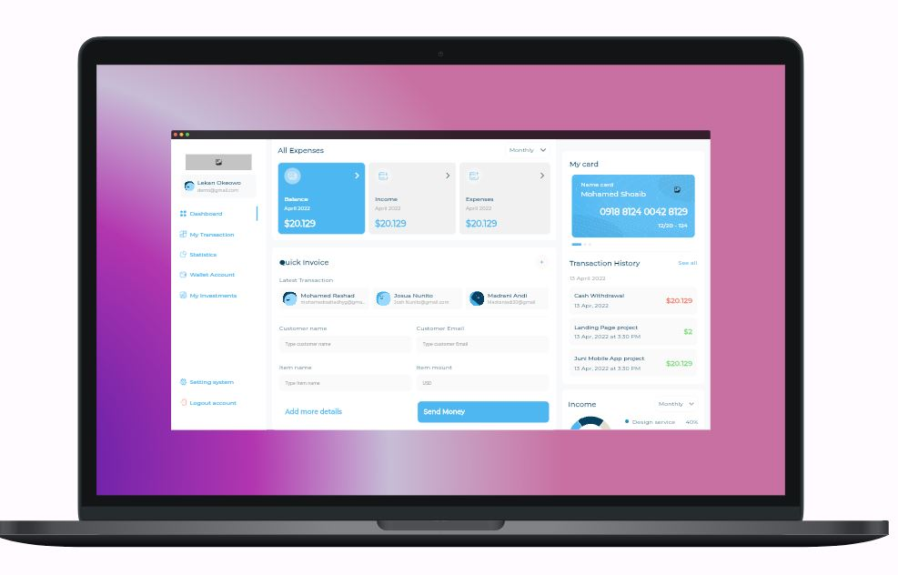
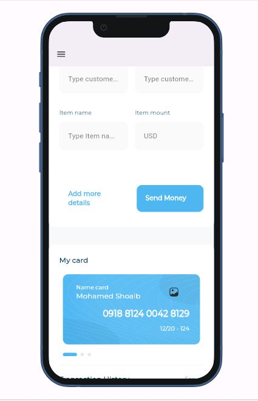

# Flutter Adaptive Dashboard UI 
Welcome to the Flutter Adaptive Dashboard UI project !
This project aims to create a responsive and adaptable dashboard user interface using Flutter's powerful framework. We'll build beautiful and efficient UIs that adapt to various screen sizes and orientations, making it perfect for dashboard applications accessible across different devices.

## Getting Started
If this is your first Flutter project or need a refresher, here are some resources:

## Lab: Write your first Flutter app: Follow this codelab to practice writing your first app and get familiar with the basics: https://docs.flutter.dev/codelabs
Cookbook: Useful Flutter samples: Explore various Flutter samples and find solutions to common tasks: [cookbook](https://docs.flutter.dev/cookbook)
Online documentation: Refer to the online documentation for comprehensive guidance on Flutter development, tutorials, samples, and the full API reference: https://docs.flutter.dev/

## Features
Responsive Layout: Utilize Flutter's layout widgets like Row, Column, Expanded, and Flexible to create a layout that adjusts based on the screen size.
Adaptive Design: Implement adaptive design principles to ensure the dashboard UI functions well on different devices, including smartphones, tablets, and desktops.
Interactive Widgets: Incorporate interactive widgets like buttons, charts, graphs, and data tables to provide users with a dynamic and engaging experience.
Custom Styling: Customize the UI with themes, colors, fonts, and animations to match the branding and enhance the user experience.

## How to Use
1. Clone or download: Obtain the project repository from your preferred source (e.g., GitHub).
2. Open in your IDE: Open the project in your preferred Flutter development environment (e.g., Android Studio, VS Code).
3. Explore and customize: Explore the existing codebase and adapt it to your specific needs.
4. Test on different devices: Ensure responsiveness and adaptability by testing the application on various devices and screen sizes.
5. Refer to resources: Use the mentioned documentation and resources for further assistance and learning.

## Contributions

We welcome your contributions to this project! Whether you're fixing bugs, adding new features, or improving documentation, your efforts are highly appreciated. Please follow the standard contribution guidelines outlined in the project repository.

## Mac UI 

## Web UI

## Mobile UI

## Tab UI
